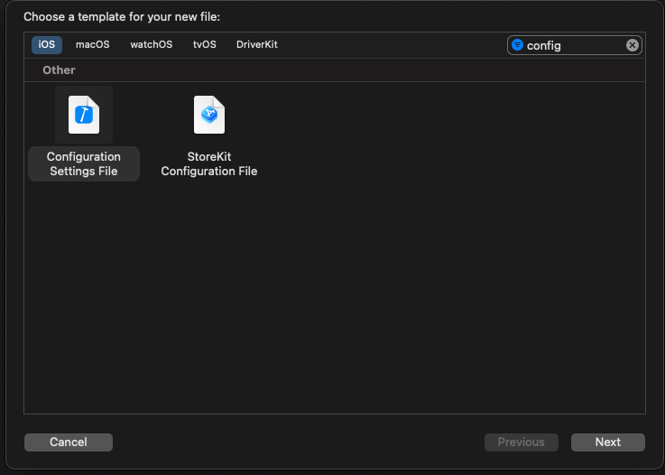

# How to mange the API keys in a swift project


The problem I just ran into was how to store the API key properly in my iOS project. I used to, for the small exercise project, store them in a constant `Struct` object. This is not, however, a good way for any non-exercise projects. Indeed, according to this  [article](https://nshipster.com/secrets/), the only true way is to store any secrets on the server instead of on the client side:

>No matter how much we obfuscate a secret on the client, it’s only a matter of time before the secret gets out. Given enough time and sufficient motivation, an attacker will be able to reverse-engineer whatever you throw their way.

>The only true way to keep secrets in mobile apps is to store them on the server.

Nonetheless, there are some approaches, albeit not best practices, that can limit the danger of leaking and properly maintain API keys, especially for projects that will upload to GitHub, for personal projects that have no need for the server.

## Manage API keys using Xcode Config file

Firstly, we need to create a xcode setting file(xcconfig) and type our API key in this file.



```swift
CLIENT_ID = pIB6Tvwj35naEclaClNEgAu2gJy9OW4a
CLIENT_SECRET = fekcAGGTKVFyk644ZbmHBaWtr7scJhwb
```

Then we can store the `CLIENT_ID` and `CLIENT_SECRET ` in the `info.plist` file and get the value of those two variables using `$(CLIENT_ID)` and `$(CLIENT_SECRET)`.


Finally we need to go to the project settings page. Under the `info` tab, set the `Config` for the debug configuration. You can add more setting files and refer them here for different configurations(ex. Release).


Done! You can now use the following code to retrieve those api keys:

```swift
let clientID = Bundle.main.infoDictionary!["CLIENT_ID"] as! String
let clientSecret = Bundle.main.infoDictionary!["CLIENT_SECRET"] as! String
```

Or, if you're not sure if those keys exist, a secure method:

```swift
let clientSecretValue = Bundle.main.infoDictionary?["CLIENT_SECRET"] as? String
guard let clientValue = clientSecretValue, !clientValue.isEmpty else { return }
```